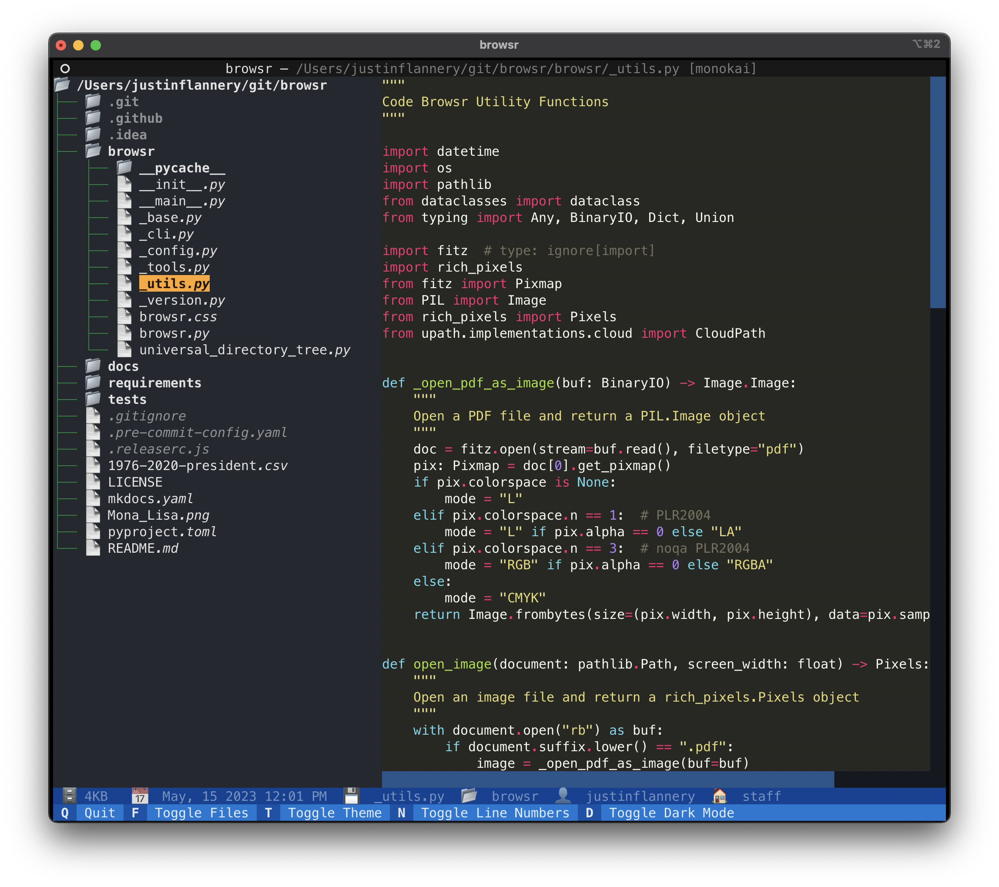

# browsr

<div align="center">
<a href="https://github.com/juftin/browsr">
  
</a>
</div>

[](https://github.com/juftin/browsr)
[](https://pypi.python.org/pypi/browsr/)
[](https://github.com/juftin/browsr/actions/workflows/tests.yaml?query=branch%3Amain)
[](https://github.com/juftin/browsr/blob/main/LICENSE)

**`browsr`** is a TUI (text-based user interface) file browser for your terminal.
It's a simple way to browse your files and take a peek at their contents. Plus it
works on local and remote file systems.

<style>
  .grid-item {
    transition: all 0.5s ease;
  }

  .grid-item:hover {
    transform: scale(1.2);
  }

  .expanded {
    position: fixed;
    top: 0;
    left: 0;
    width: 100%;
    height: 100%;
    background-color: rgba(0, 0, 0, 0.9);
    display: flex;
    align-items: center;
    justify-content: center;
    z-index: 9999;
  }

  .expanded img {
    max-width: 80%;
    max-height: 80%;
    object-fit: contain;
  }
</style>

<body>
  <div class="grid" style="display: grid; grid-template-columns: repeat(2, 1fr); grid-gap: 10px;">
    <div class="grid-item">
      
    </div>
    <div class="grid-item">
      
    </div>
    <div class="grid-item">
      
    </div>
    <div class="grid-item">
      
    </div>
  </div>

  <div class="expanded" style="display: none;">
    
  </div>

  <script>
    var expanded = document.querySelector('.expanded');
    expanded.onclick = function() {
      this.style.display = 'none';
    };
  </script>
</body>

## Installation

The below command recommends [pipx](https://pypa.github.io/pipx/) instead of pip. `pipx` installs the package in
an isolated environment and makes it easy to uninstall. If you'd like to use `pip` instead, just replace `pipx`
with `pip` in the below command.

```shell
pipx install browsr
```

## Extra Installation

If you're looking to use `browsr` on remote file systems, like AWS S3, you'll need to install the `remote` extra.
If you'd like to browse parquet files, you'll need to install the `parquet` extra. Or, even simpler,
you can install the `all` extra to get all the extras.

```shell
pipx install "browsr[all]"
```

## Usage

```shell
browsr ~/Downloads/
```

Simply give `browsr` a path to a file/directory and it will open a browser window
with a file browser. You can also give it a URL to a remote file system, like AWS S3.

```shell
browsr s3://my-bucket/my-file.parquet
```
